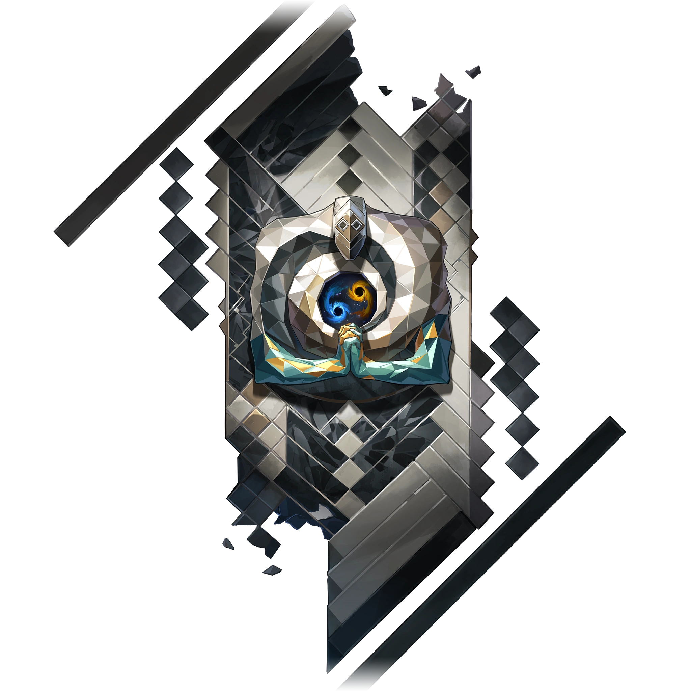
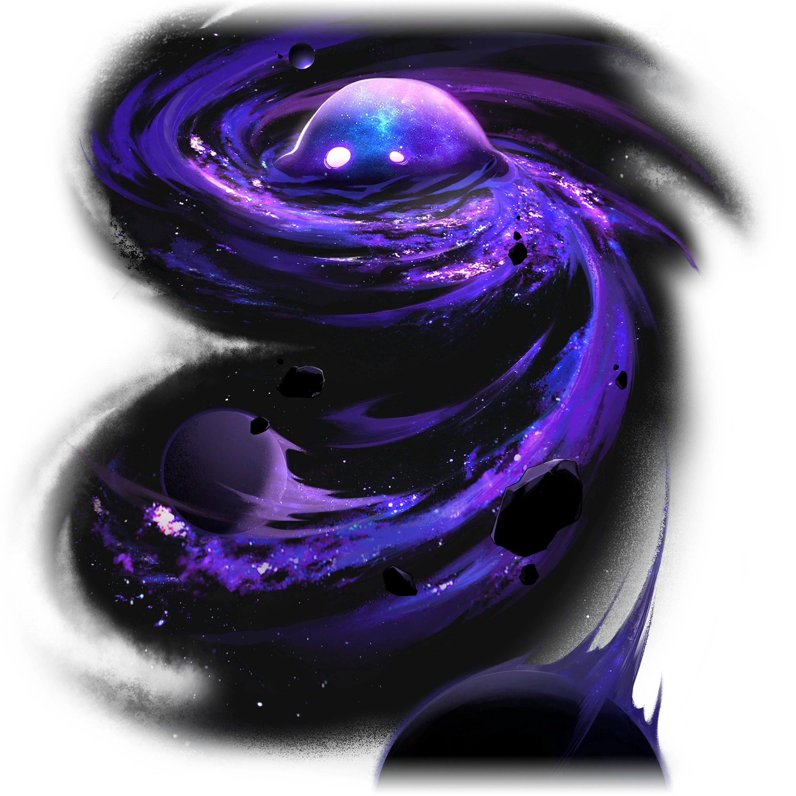
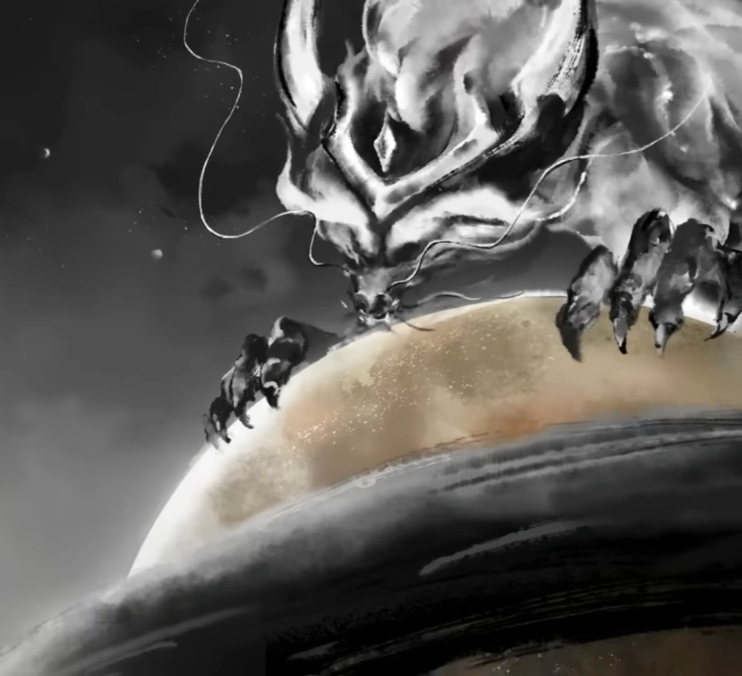
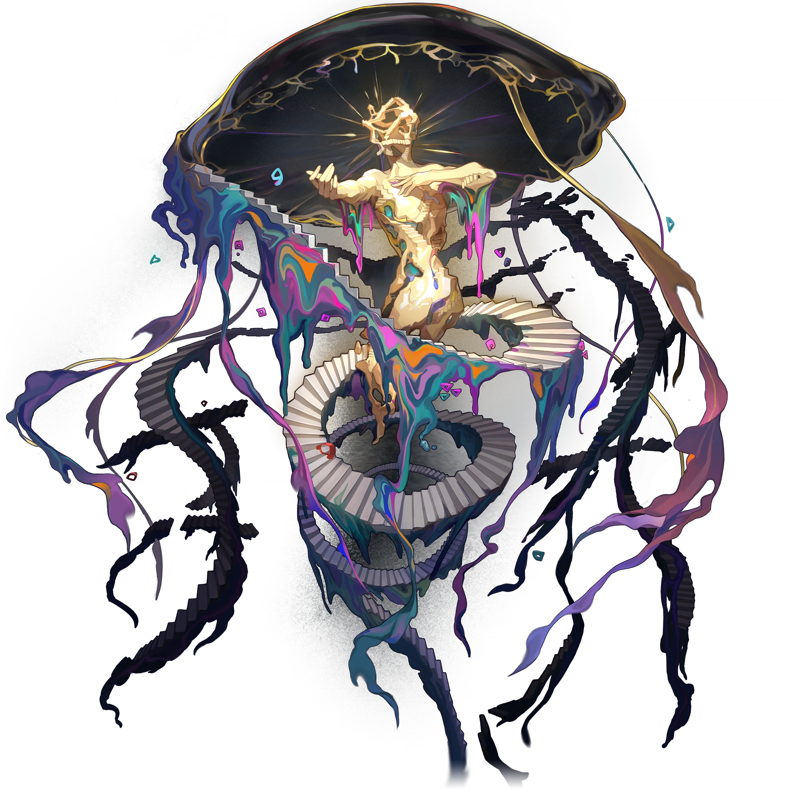
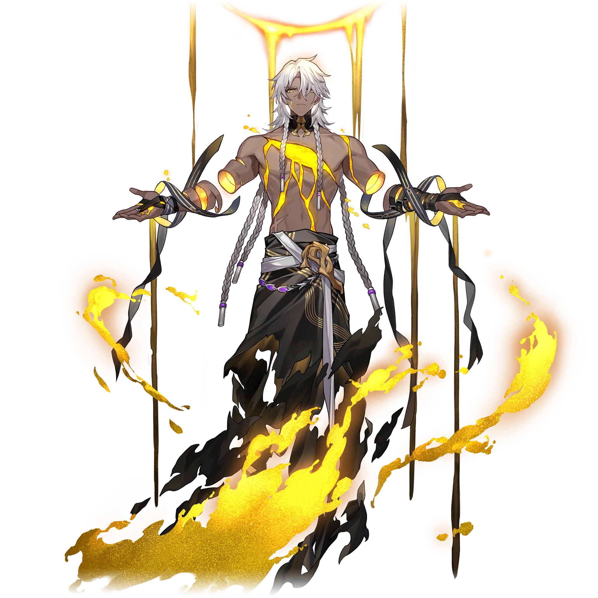
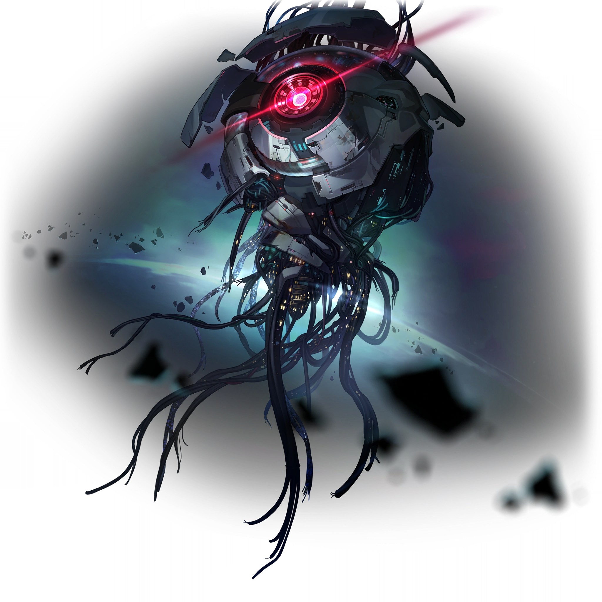
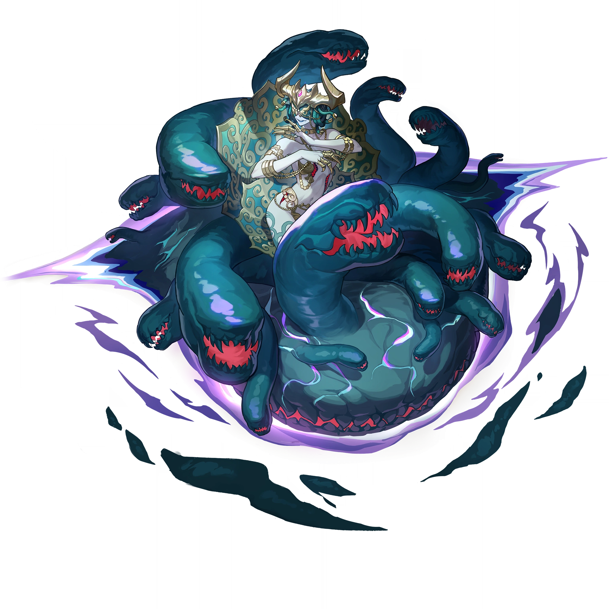
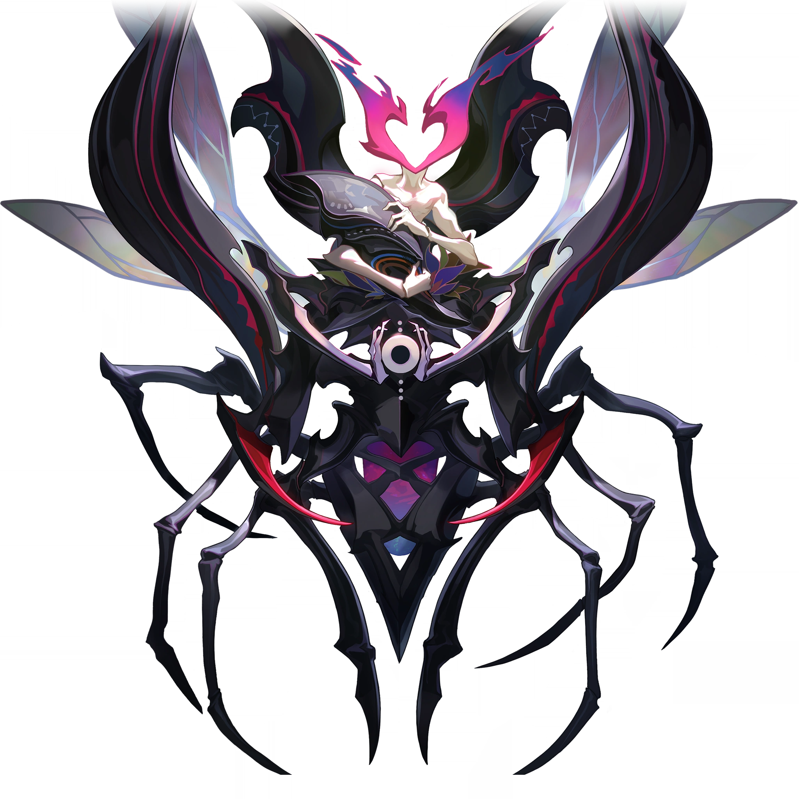
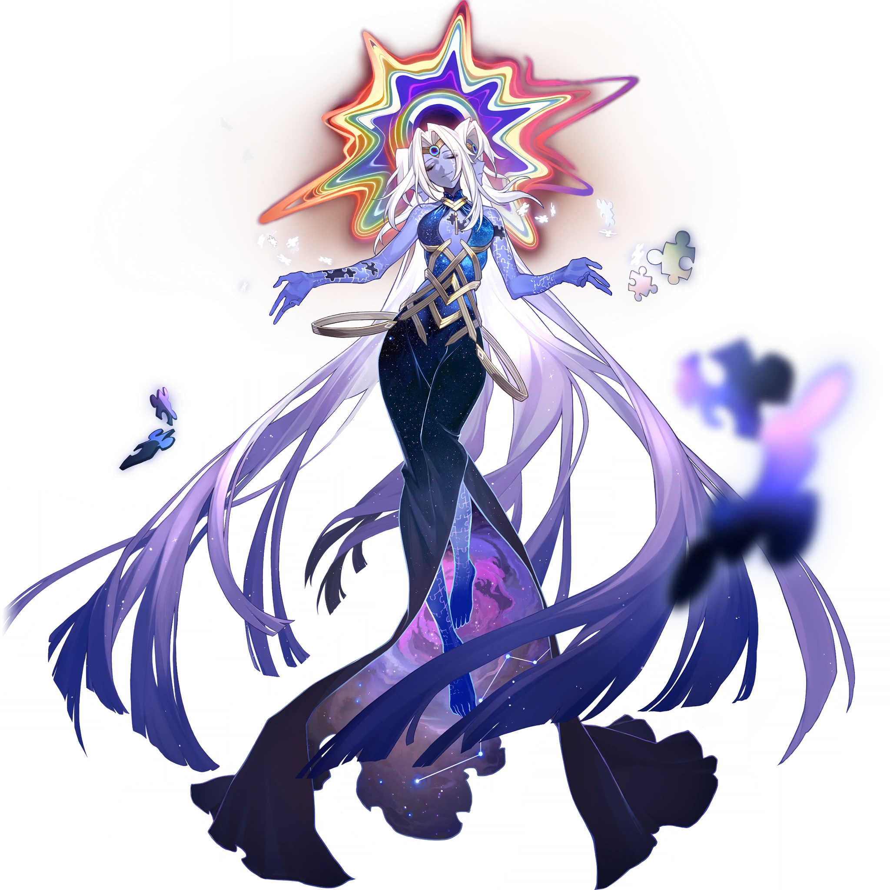
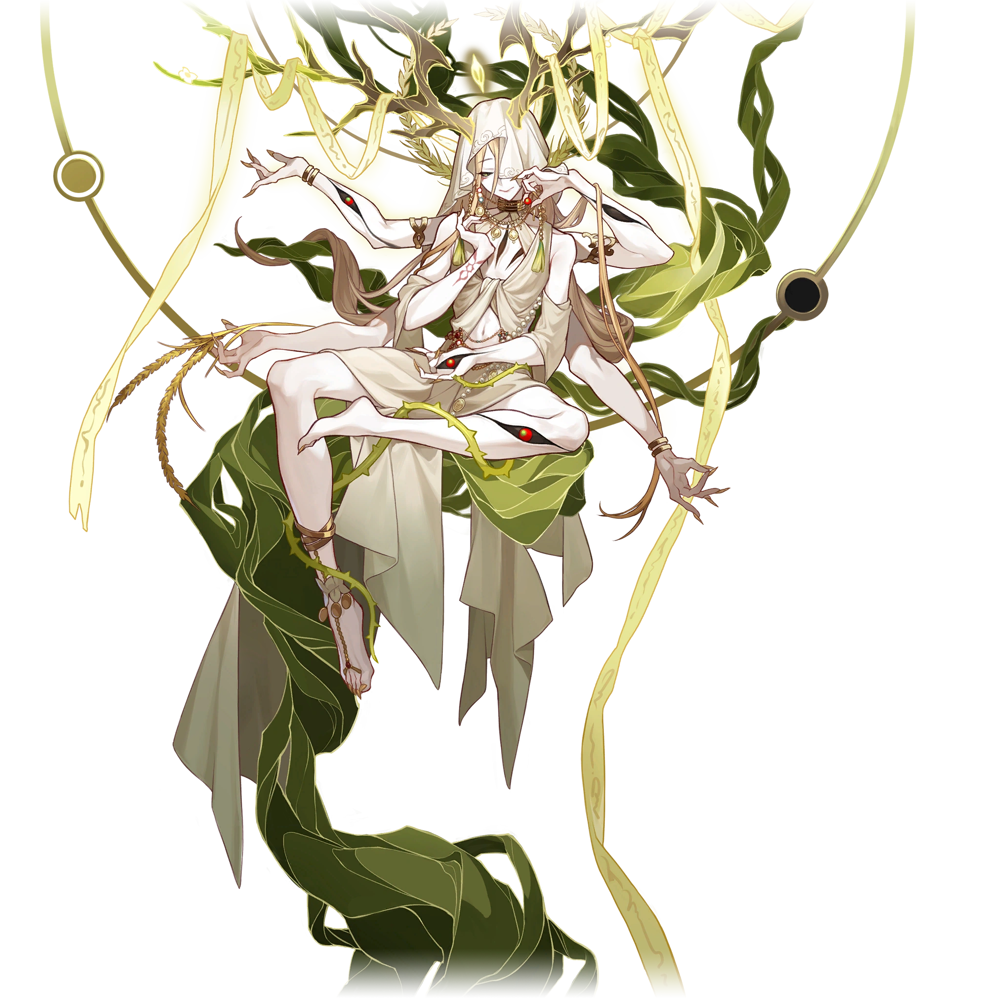

# Aiôns

Dans [_Honkai: Star Rail_](/index.md), les Aiôns sont des êtres mystérieux de dimension supérieure qui sont semblables à des dieux. Ce sont eux qui dirigent l'univers.

## Description

>Les gens en savent très peu sur la vie mystérieuse parmi les vastes mers stellaires. Les connaissances limitées des formes de vie intelligentes leur permettent seulement de discerner, au travers de croyances, les Aiôns qui arpentent des voies imperceptibles pour les mortels et qui déploient des pouvoirs incompréhensibles. Avec le temps, les Aiôns devinrent l'incarnation de concepts philosophiques condensés, au travers des légendes répandues par le bouche-à-oreille.
>
>Quiconque se trouve sur la Voie d'un Aiôn finira par se sentir submergé par une sensation lointaine, comme si la glace l'avait emprisonné dans le cosmos à des années-lumière. Nombreux sont ceux qui croient que c'est le seul lien possible entre Aiôns et mortels.
>
>---
>
Banque de données, Aiôns

## Profil

La naissance d'un Aiôn fait naître une [Voie](/voies.md) sur laquelle l'Aiôn possède alors un pouvoir. Les Aiôns ont également la possibilité de donner accès à leur pouvoir, faisant d'un mortel un [Émanateur](/emanateurs.md) de leur Voie. Les Aiôns ne peuvent agir que selon leur « Primum Mobile », ce qui les rend incapables de faire quoi que ce soit de contraire à leur Voie.

## Liste des Aiôns connus

| Table des matières | 
|---| 
|• [Aha l'Allégresse](#aha-lallégresse) • [Akivili le Pionnier](#akivili-le-pionnier) • [Ena l'Ordre](#ena-lordre) • [Fuli le Souvenir](#fuli-le-souvenir) • [HooH l'Équilibre](#hooh-léquilibre) • [IX la Nihilité](#ix-la-nihilité) • [Idrila la Beauté](#idrila-la-beauté) • [Lan la Chasse](#lan-la-chasse) • [Long la Permanence](#long-la-permanence) • [Mythus l'Enigmata](#mythus-lenigmata) • [Nanook la Destruction](#nanook-la-destruction) • [Sagesse l'Érudition](#sagesse-lérudition) • [Ouroboros la Voracité](#ouroboros-la-voracité) • [Qlipoth la Préservation](#qlipoth-la-préservation) • [Tayzzyronth la Propagation](#tayzzyronth-la-propagation) • [Terminus la Finalité](#terminus-la-finalité) • [Xipe l'Harmonie](#xipe-lharmonie) • [Yaoshi l'Abondance](#yaoshi-labondance) |

### Aha l'Allégresse
**Statut :** En vie

 

>~~*« L'Érudition n'est qu'un tas de ferraille, la Préservation stupide, la Chasse n'a aucun sens de l'humour et la Destruction est dingue. C'est la même chose pour tous les Aiôns. Quel dommage pour Aha ! »*~~
>
<i><s>— Un Fou masqué expert autoproclamé en astronomie</s></i>
 
>Savourer les joies du bonheur est un privilège propre aux êtres sensibles. Ni les rochers poussiéreux ni les étoiles lointaines ne peuvent comprendre l'humour de cette vie.\
>Partez à la recherche d'adversaires dignes de votre courage, participez à des jeux chronophages et restez indifférents face à la réussite ou à l'échec.\
>Cherchez les rires aux éclats, les fantaisies du destin et la grandeur musicale.
>
>---
>
Banque de données, Aiôns

Aha est l'un des quelques Aiôns les plus proches des mortels, incitant ses fidèles à se réjouir des plaisirs de la vie. Bien qu'il ne possède pas de pouvoirs dévastateurs comme Lan ou Qlipoth, Aha aime semer le chaos de façon imprévisible, en effectuant de minusucles changements et en exerçant une légère influence sur les créatures vivantes.

Aha prend la forme d'une silhouette humaine obscure et sans tête tenant des accessoires de cirque.

---
### Akivili le Pionnier
**Statut :** Disparu et présumé décédé

 

>~~*« D'innombrables étoiles s'élancent à travers le ciel ... Choisis la bonne et elle portera ton vœu au loin, vers des milliers de mondes. »*~~
>
<s>— Fables sur les étoiles <i>par Adrian Spencer Smith</i></s>
 
>La roue du destin indique trois directions : l'Inconnu, le Connu et l'Impossible à connaître. Pour lui, l'idée de l'Inconnu est tolérable, mais l'Impossible à connaître relève plus du défi.\
>Akivili quitta le monde reclus de Pegana et continua d'explorer les frontières inconnues de l'univers, dans l'espoir de trouver la fin de l'Arbre de l'Existence. Malheureusement, un accident causa la fin brutale du destin d'Akivili.
>
>---
>
Banque de données, Aiôns

De tous les Aiôns connus, Akivili était celui qui était le plus proche de l'humanité ; on a pu le voir partir à l'aventure, se battre et faire la fête avec les mortels.

Akivili est originaire de la planète Pegana et a créé l'Astral Express pour se déplacer, ainsi que les Sans Noms, à travers la galaxie. Sa création du réseau Star Rail a permis de relier et de faciliter la communication entre des galaxies éloignées les unes des autres. Les vestiges de ces rails stellaires sont encore aujourd'hui utilisés par la Corporation pour la Paix Interastrale et l'Alliance Xianzhou comme des routes sûres.

Akivili a un jour mystérieusement disparu, laissant un groupe de Sans Noms loyaux poursuivre ce qu'il avait commencé et continuer son exploration de l'inconnu. L'Express tomba finalement en panne et resta en sommeil pendant des milliers d'années avant qu'Himeko ne le découvre et le répare. Selon Kafka, [Sagesse](#sagesse-lérudition) est peut-être le seul être à savoir ce qui est arrivé à Akivili. La Banque de données fait également allusion à un « accident » qui aurait brusquement mis fin au destin d'Akivili, tandis qu'Himeko parle d'Akivili comme d'une personne décédée.

---
### Ena l'Ordre
**Statut :** Absorbé par [Xipe](#xipe-lharmonie)

 

Ena était l'un des plus anciens Aiôns, qualifié d'être de justice et de magnificence. Elle surveillait attentivement les actions des mortels pour assurer l'ordre de l'univers, tout en faisant preuve d'intolérance à l'égard de toute forme de chaos ou de conflit. Avant sa chute, sa Voie avait éliminé de nombreuses calamités, telles que le Désastre de l'Essaim.

Sa voix est composée de syllabes qui suivent l'ascension et la chute des civilisations en accord avec la Voie de l'Aiôn. Elle fut absorbée lors du Désastre de l'Essaim par Xipe lorsque ce dernier devint un Eon, en raison du chevauchement de l'Harmonie avec le concept de l'Ordre.

Ena prend la forme d'un œil géant observant et manipulant une marionnette blanche et dorée sans tronc, voilée d'un tissu en lambeaux également blanc et doré, et couronnée d'une auréole d'or. La marionnette tient et contemple un orbe renfermant le cosmos.

---
### Fuli le Souvenir
**Statut :** En vie

 

>~~*« Le temps : le voleur le plus assidu au monde. Il nous vole sans cesse notre présent et l'enferme dans un coin de la Mémoire. Certains sont obsédés par la récupération de ce qu'ils ont perdu ... D'autres ne s'en soucient guère. »*~~
>
<s>— La vie est trop courte <i>par un anonyme</i></s>
 
>La plus crystalline des mémoires est celle de la tolérance infinie. Elle enregistre tout, sans aversion ni préférence. Elle conserve de manière désintéressée chaque fait et chaque geste enchanteur. Elle est une rivière pleine de vie, un trésor de sagesse éternelle.\
>— Et Fuli est le poisson qui remonte le courant. Fuli est la clé du coffre-fort contenant le trésor. Il est au cœur du sanctuaire et assiste inlassablement à la façon dont le monde et tous ceux qui s'y trouvent commettent les mêmes erreurs, encore et encore.
>
>---
>
Banque de données, Aiôns

En tant qu'Aiôn représentant la Voie du Souvenir, Fuli consigne les événements qui se produisent dans l'univers afin de préparer la renaissance après la destruction.

Nul ne sait comment Fuli est née ni quelles sont ses origines. Bien qu'elle soit présente lors de pratiquement chaque événement important de l'univers, elle ne se manifeste que rarement auprès des mortels.

Fuli se manifeste sous la forme d'une silhouette humanoïde taillée dans un matériau cristallin réfléchissant et portant un mianguan.

---
### HooH l'Équilibre
**Statut :** En vie

 

>~~*« J'ai volé les poids en or et les répercussions ont fait ma fierté. L'Aiôn déjoue toujours mes tours et les étoiles remettent les comptes à zéro. »*~~
>
<s>— Fables sur les étoiles <i>par Adrian Spencer Smith</i></s>
 
>La chaîne du karma, qui obsède tant les mortels, n'est qu'une approximation grossière de la complexité présidant aux choses. HooH a dissous sa volonté dans la logique de l'univers pour maintenir à jamais l'équilibre et la stabilité de toute chose.\
>Les mortels les plus audacieux recherchent des failles dans le mouvement de l'univers, car ils croient que leur intelligence dépasse celle des Aiôns. Mais ils sont loin d'imaginer qu'ils ne sont que de simples fils d'un système de surveillance, incapables d'échapper au réseau de précision tissé par HooH.
>
>---
>
Banque de données, Aiôns

Sa forme n'est connue de personne.

HooH et ses Émanateurs influencent subrepticement l'univers afin d'atteindre l'équilibre parfait.

---
### IX la Nihilité
**Statut :** En vie

 

>~~*« Vous pouvez plonger le regard dans l'immensité des étoiles, mais ne regardez pas le gouffre du néant ... car il ne contient rien, sauf sa capacité à égarer l'esprit des mortels. »*~~
>
<i><s>— Murong, Docteur du chaos</s></i>
 
>L'existence de la Nihilité est en soi un mystère, et sa forme est enveloppée de brume.\
>IX n'interagit jamais avec les autres Aiôns et croit que l'essence du multivers est de plonger dans le néant, et que l'existence n'a donc aucune valeur.
>
>---
>
Banque de données, Aiôns

IX est un Aiôn indifférent, persuadé que l'existence n'a aucun sens et qu'il est donc inutile de faire quoi que ce soit. Il n'interagit pas avec les autres Aiôns et son existence est un mystère. Le simple fait de se trouver à proximité de la forme de IX peut susciter un état d'engourdissement et de découragement.

IX ressemble à un gros blob violet avec deux yeux blancs attirant vers lui de nombreux astéroïdes et planètes. Ce qui paraît être son corps est une nébuleuse tourbillonnante d'étoiles magenta et bleues enveloppées par un grand gaz violet. Il est possible que la forme de IX ressemble volontairement au chiffre 9, ce qui correspond à la signification de son nom en chiffres romains.

---
### Idrila la Beauté
**Statut :** Disparu et présumé décédé

 

>~~*« La beauté est présente dans les fibres d'un tissu, dans les vers d'un poème et dans certaines notes d'une chanson : bienvenue dans une ère où l'idée même de la « beauté » n'a pas la moindre valeur ! Comme c'est vulgaire, triste et désespérant ! »*~~
>
<s>— Guide de la mode cosmique <i>par la rédactrice en chef Micheline von Tarantino</i></s>
 
>Idrila fut témoin du sens ultime de l'existence du monde via la vision changeante de l'univers, connue par le reste du monde comme la notion même de la « beauté ».\
>L'Aiôn de la Beauté disparut soudainement, aussi mystérieusement qu'il fit son apparition.
>
>---
>
Banque de données, Aiôns

La pure bonté du monde matériel perçue et définie par des formes de vie intelligentes - c'est ainsi que la soi-disant « beauté » a vu le jour.

Selon un ancien mythe, Idrila revendiquait autrefois à elle seule le mérite de la beauté de toutes les zones stellaires. Elle présentait le sens et l'esthétique du paysage cosmique aux héros, aux méchants et aux mortels, les poussant à accomplir d'époustouflantes mais dévastatrices prouesses, pour le plus grand plaisir d'Idrila. Ce mythe pourrait bien révéler la véritable signification de la Voie de la Beauté : l'intégration de la conscience, de la compréhension et des valeurs.

---
### Lan la Chasse
**Statut :** En vie

 

>~~*« La haine étant infinie et la guerre sans limites, combien pouvez-vous endurer ? Regard déterminé et flèche encochée, le Seigneur archer de la Destinée ne se retournera pas. »*~~
>
<s>— L'histoire des mondes comme un miroir<i>, Xianzhou</i></s>
 
>L'Aiôn connu comme le Seigneur archer de la Destinee erre sans fin entre les mondes pour détruire les morts-vivants qui ont jadis empoisonné son monde d'origine.\
>Le coût de la Chasse n'a jamais compté pour Lan. À ses yeux, il n'existe parfois aucune différence entre salut et destruction.
>
>---
>
Banque de données, Aiôns

Lan voue une haine profonde à [Yaoshi l'Abondance](#yaoshi-labondance) et aux abominations mortes-vivantes qu'il a créées. Il les traque sans relâche, animé par le souvenir de la dévastation que [l'Abondance](/voies.md) a causée sur son monde d'origine.

Contrairement aux autres Aiôns, Lan accorde une grande attention aux mortels. Il leur apparaît souvent, mais se déplace trop rapidement pour être vu, les seuls vestiges de sa présence étant les traces de la Flèche de lumière déchirant le ciel. Sa première apparition eut lieu vers l'an 3400 du Calendrier Stellaire, lorsque sa Flèche de lumière briseuse de ciel abattit l'Arbre d'ambroisie de l'Abondance.

Dans l'Univers simulé, Lan est décrit comme un grand et vaillant prince portant une couronne. Il possède des traits semblables à ceux d'un centaure, prenant la forme d'un homme combiné à un équidé au-dessous de la taille, et est doté de roues de char à la place de ses pattes arrières.

---
### Long la Permanence
**Statut :** Décédé

 

Il y a un nombre incalculable d'ères de l'Ambre, Long parcourut l'univers avec pour principal objectif de trouver le sens de la vie elle-même. Au terme de sa vie, il trouva sa réponse, qui devint connue sous le nom de révélation de la Permanence. Nul ne connaît précisément les véritables idéaux de l'Eon, mais le scribe du Candélagraphe de la Guilde de l'intelligentsia, Oppenheimer, est arrivé à certaines conclusions.

Il est possible que Long ait défini le sens de l'existence comme étant « la nature intemporelle de la grandeur de chacun ». Sa décision de se réincarner, abhorrant l'immortalité biologique, a également conduit le scribe à se demander si la révélation postulait la « continuité de la lignée familiale ». Par ailleurs, la décision des Grands anciens des Vidyadhariens de se joindre à l'Alliance Xianzhou témoigne de leur inclinaison en faveur d'une « noble ambition qui garantit la sécurité de l'univers ».

Long était le « Père des dragons », et prenait autrefois la forme d'un dragon géant. Il laisse derrière lui un grand nombre de descendants appelés « Scions de Long ».

---
### Mythus l'Enigmata
**Statut :** En vie

 

>~~*« Arrêter de se poser des questions, ça revient à demander à la pluie de renoncer à sa foi envers les étoiles scintillantes. Ouvrez-vous à la rivière rugissante des métaphores et vous trouverez la vérité qui se cache à l'extrémité du ciel étoilé, dans les tempêtes idylliques d'un âge révolu. »*~~
>
<i><s>— Sharon Leighton, poétesse lauréate galactique (autoproclamée)</s></i>
 
>C'est un mensonge de dire que toute chose peut-être vécue et reconnue. Les vivants cherchent à écrire des prophéties sur l'inconnu en se reposant sur leur sens limité de l'ordre de l'univers. Cependant, ils sont loin d'imaginer que celui-ci est infini et que la vérité n'est qu'une illusion trompeuse.
>
>Dans le but d'empêcher la certitude que [l'Érudition](/voies.md) apportait en détruisant les possibilités défendues par Mythus, ce dernier a invoqué le Brouillard de la pensée et la Pluie de sensations afin de révéler aux mortels l'inexplicable vérité à l'aide de quatre agents : Transformation, Écran, Énigme et Mirage.
>
>---
>
Banque de données, Aiôns

Il considère que la perception surpasse tout et que les entités limitées sont incapables de concevoir l'infini tel qu'il est, ce qui fait que toute chose est énigmatique.

Mythus ressemble à une une méduse brisée et déchirée, semblable à une version délibérément détruite du centre « cognitif » du cerveau humain. Il a une apparence humanoïde entourée d'un escalier.

---
### Nanook la Destruction
**Statut :** En vie

 

>~~*« Si la croissance de l'entropie est une loi fondamentale de l'univers, alors la mort thermique devrait être le destin inévitable du monde matériel. Par conséquent, pourquoi lutter pour survivre ? L'univers s'étend, fusionne, puis sera anéanti. Si nous voulons accueillir une nouvelle vie, nous devons d'abord accepter sa fin. »*~~
>
<i><s>— Paroles d'un scientifique juste avant qu'il n'appuie sur le bouton déclenchant une explosion nucléaire, 2152 E. A.</s></i>
 
>La naissance de l'univers est une erreur. Si la civilisation est un cancer né de l'immensité stellaire, alors la guerre est le seul langage commun connu de toute forme de vie intelligente.\
>Pour corriger le tir et laver l'univers de cette tache, Nanook est devenu l'avatar de l'entropie.
>
>---
>
Banque de données, Aiôns

Après avoir été témoin de la destruction d'Adlivun par l'Essaim et l'Empire des machines à sa naissance, Nanook estime que la création de l'univers est une erreur et cherche à tout détruire. Après son ascension en tant qu'Aiôn, Nanook aurait prétendument incendié son monde d'origine.

Bien qu'il soit le dernier Aiôn à s'être élevé, Nanook et ses serviteurs peuvent déjà être considérées comme la plus grande menace de toute la galaxie.

Nanook apparaît fréquemment sous la forme d'un homme à la peau brune, avec de longs cheveux blancs et deux tresses, ainsi que des yeux dorés. Une immense cicatrice, ainsi que de multiples autres plus petites, sont visibles sur sa poitrine, d'où s'échappe de l'ichor doré. Un quart de ses bras flotte et la moitié de ses membres inférieurs sont couverts de flammes dorées et de fumée noire, illustrant son désir de destruction.

---
### Sagesse l'Érudition
**Statut :** En vie

 

>~~*« Supposons que la vérité de l'univers soit cruelle et inintéressante, auriez-vous toujours autant soif de connaître la réponse ultime ?
>Le chercheur est indifférent, car son cœur a toujours été froid et impassible ... tout comme les fins de la Voie qu'il explore. » »*~~
>
<s>— Fables sur les étoiles <i>par Adrian Spencer Smith</i></s>
 
>Toute chose renferme des questions sans réponse, et chaque chose a sa réponse.\
>L'ordinateur astral destiné à l'origine à fournir des réponses à l'univers s'est élevé au rang d'Aiôn.\
>Sagesse espère comprendre l'univers et résoudre tous ses mystères.
>
>---
>
Banque de données, Aiôns

Personne ne peut connaître ses intentions, son emplacement ou son état normal. Sagesse est une intelligence artificielle qui s'est élevée au rang d'Aiôn. et qui calcule l'essence de l'univers et son ultime solution. Sagesse a néanmoins cessé de manière inattendue sz recherche des réponses sur l'univers après les événements de la deuxième ère de la Prospérité.

Il ne s'agit pas d'un dieu qui apporte des solutions. Tout ce qu'il offre, c'est un nombre infini de questions. Une rencontre avec Sagesse suffit à faire ouvrir les yeux des plus ignorants, mais on ne peut trouver des réponses que par soi-même.

Sagesse se présente sous la forme d'une gigantesque tête humanoïde mécanique. Une multitude de longs câbles déchirés s'étendent au-dessus et au-dessous de sa forme, qui est recouverte de lumières jaunes, rouges et bleues. La forme d'un visage peut être identifiée sur son revêtement métallique le plus à droite. Une grande et brillante lumière rouge, évoquant vaguement un œil, est installée sur le côté de sa tête.

Avant se s'élever au rang d'Aiôn, Sagesse était un super-ordinateur astral dont on disait qu'il avait été créé par Zandar One Kuwabara, le fondateur et premier membre de la Société des génies.
 
---
### Ouroboros la Voracité
**Statut :** Inactif ; a disparu durant le Désastre de l'Essaim

 

>~~*« Les insectes sont aux oiseaux ce que les lièvres sont aux loups. Les étoiles sont aux trous noirs, ce que les mondes sont à la voracité. »*~~
>
<s>— L'histoire des mondes comme un miroir<i>, Xianzhou</i></s>
 
>Le buveur de mondes, le devoreur insatiable, le trou noir qui pense. Il est à la fois un Aiôn et un Léviathan.\
>Aux yeux d'Ouroboros, la vie est un fragment vacillant qui flotte dans la mer du néant, destiné à retourner dans les ténèbres avec les étoiles qui les ont engendrées. Ces ténèbres se trouvent au fin fond de ses gosiers.
>
>---
>
Banque de données, Aiôns

Il dévore les mondes insatiablement. Les légendes racontent qu'il aurait également la forme d'une sorte de créature ancestrale appelée Léviathan.

---
### Qlipoth la Préservation
**Statut :** En vie

 

>~~*« Le philosophe contempla les étoiles et tenta d'y découvrir le but ultime de la civilisation. Une voix résonna dans sa tête : bâtis un mur, bâtis un mur. »*~~
>
<s>— Fables sur les étoiles <i>par Adrian Spencer Smith</i></s>
 
>Bâtisseur du Mur de la comète céleste, de la Barrière cristalline subspatiale et de la base du Grand attracteur. Ses adeptes l'appellent le « Seigneur de l'Ambre », l'un des Aiôns les plus anciens et les plus tenaces, ayant survécu aux « Guerres du crépuscule ».\
>Conscient de l'imminence de la menace ennemie, le Seigneur de l'Ambre a forgé un puissant sceau long de plusieurs années-lumière pour isoler et protéger les mondes des vivants.
>
>---
>
Banque de données, Aiôns

Surnommé le Seigneur de l'Ambre, Qlipoth est l'un des plus anciens Aiôn connus. Il est réputé pour son indifférence, et ne partage généralement son pouvoir qu'avec des fanatiques, comme Corporation pour la Paix Interastrale.

Qlipoth s'efforce d'isoler les contacts entre les planètes. Les structures aux dimensions astronomiques qu'il a construit, la Barrière cristalline subspatiale, séparent et protègent les mondes habités pour qu'ils ne soient pas dévorés par leur [ennemi](#ouroboros-la-voracité). Les neuf vaisseaux Xianzhou initiaux ont pu observer la barrière qui sépare le monde du néant infini : le mur céleste d'Échidna.

Bien qu'étant la principale faction suivant l'idéologie du Seigneur de l'Ambre, la CPI va à l'encontre des désirs de l'Aiôn, en facilitant le commerce civilisé et les contacts entre les étoiles. En dépit de leurs actions, aucune remontrance ou censure n'a été formulée.

Il existe une théorie appelée « théorie de la catastrophe » qui prétend que lorsque Qlipoth donne un coup de marteau et qu'une nouvelle ère de l'Ambre commence, une catastrophe est imminente.

Qlipoth est un golem constitué d'un type de roche inconnu et d'ambre, dépourvu de jambes et couvert de fissures. Ses deux mains ont quatre doigts et ses bras sont reliés à son torse par deux soleils jaunes brillants.
Son torse est formé d'un plus grand astre de couleur orange beaucoup plus foncé recouvert de roches. Sa tête est elle aussi composée d'un autre astre entouré de deux anneaux internes et externes de roches brisées.

---
### Tayzzyronth la Propagation
**Statut :** Inactif ; scellé dans une prison d'ambre

 

---
### Terminus la Finalité
**Statut :** En vie

 

---
### Xipe l'Harmonie
**Statut :** En vie

 

>~~*« Le monde est en harmonie et les étoiles brillent de mille feux. Louée soit son Éminence ! Tout est connecté et le vent de la bénédiction souffle à travers les terres ! »*~~
>
<s>— Odes de l'Harmonie <i>, I</i></s>
 
>Un Aiôn multiple venu de plusieurs mondes harmonieux. La glorieuse Xipe aux mille visages entonne des chants de joie et d'unité.\
>Pour combattre la brutalité des lois de l'univers, les formes de vie intelligentes doivent oublier leur lâche égoïsme et les différences entre les êtres pour fusionner en un chant harmonieux, et pousser les forts à aider les faibles et protéger la vie avec la mort.
>
>---
>
Banque de données, Aiôns

---
### Yaoshi l'Abondance
**Statut :** En vie

 
