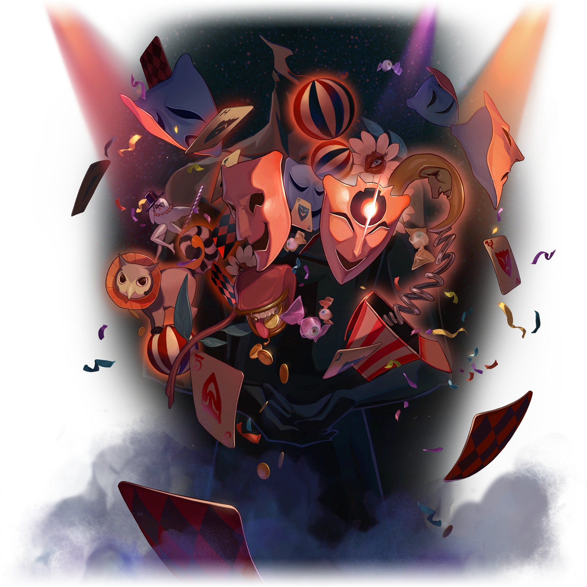
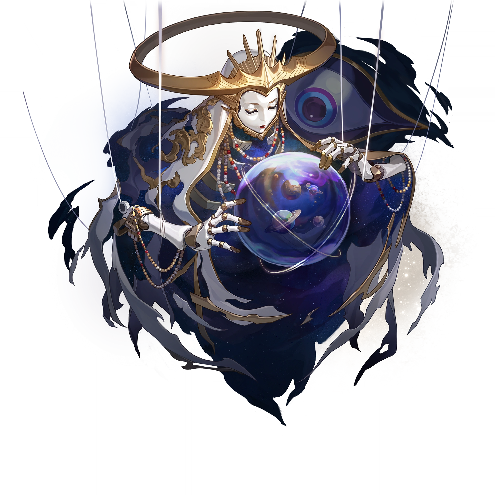
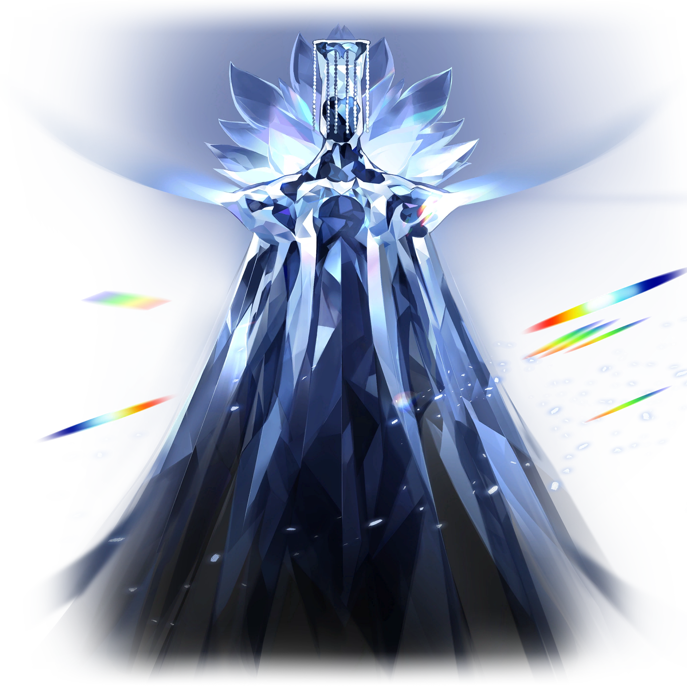

# Aiôns

Dans [_Honkai: Star Rail_](/index.md), les Aiôns sont des êtres mystérieux de dimension supérieure qui sont semblables à des dieux. Ce sont eux qui dirigent l'univers.

## Description

>Les gens en savent très peu sur la vie mystérieuse parmi les vastes mers stellaires. Les connaissances limitées des formes de vie intelligentes leur permettent seulement de discerner, au travers de croyances, les Aiôns qui arpentent des voies imperceptibles pour les mortels et qui déploient des pouvoirs incompréhensibles. Avec le temps, les Aiôns devinrent l'incarnation de concepts philosophiques condensés, au travers des légendes répandues par le bouche-à-oreille.
>
>Quiconque se trouve sur la Voie d'un Aiôn finira par se sentir submergé par une sensation lointaine, comme si la glace l'avait emprisonné dans le cosmos à des années-lumière. Nombreux sont ceux qui croient que c'est le seul lien possible entre Aiôns et mortels.
>
>---
>
Banque de données, Aiôns

## Profil

La naissance d'un Aiôn fait naître une [Voie](/voies.md) sur laquelle l'Aiôn possède alors un pouvoir. Les Aiôns ont également la possibilité de donner accès à leur pouvoir, faisant d'un mortel un [Émanateur](/emanateurs.md) de leur Voie. Les Aiôns ne peuvent agir que selon leur « Primum Mobile », ce qui les rend incapables de faire quoi que ce soit de contraire à leur Voie.

## Liste des Aiôns connus

## Table des matières
- [Aha l'Allégresse](#aha-lallégresse)
- [Akivili le Pionnier](#akivili-le-pionnier)
- [Ena l'Ordre](#ena-lordre)
- [Fuli le Souvenir](#fuli-le-souvenir)
- [HooH l'Équilibre](#hooh-léquilibre)
- [IX la Nihilité](#ix-la-nihilité)
- [Idrila la Beauté](#idrila-la-beauté)
- [Lan la Chasse](#lan-la-chasse)
- [Long la Permanence](#long-la-permanence)
- [Mythus l'Enigmata](#mythus-lenigmata)
- [Nanook la Destruction](#nanook-la-destruction)
- [Sagesse l'Érudition](#sagesse-lérudition)
- [Ouroboros la Voracité](#ouroboros-la-voracité)
- [Qlipoth la Préservation](#qlipoth-la-préservation)
- [Tayzzyronth la Propagation](#tayzzyronth-la-propagation)
- [Terminus la Finalité](#terminus-la-finalité)
- [Xipe l'Harmonie](#xipe-lharmonie)
- [Yaoshi l'Abondance](#yaoshi-labondance)

### Aha l'Allégresse  
Statut: En vie

>~~*« L'Érudition n'est qu'un tas de ferraille, la Préservation stupide, la Chasse n'a aucun sens de l'humour et la Destruction est dingue. C'est la même chose pour tous les Aiôns. Quel dommage pour Aha ! »*~~
>
<i><s>— Un Fou masqué expert autoproclamé en astronomie</s></i>
 
>Savourer les joies du bonheur est un privilège propre aux êtres sensibles. Ni les rochers poussiéreux ni les étoiles lointaines ne peuvent comprendre l'humour de cette vie.  
>Partez à la recherche d'adversaires dignes de votre courage, participez à des jeux chronophages et restez indifférents face à la réussite ou à l'échec.  
>Cherchez les rires aux éclats, les fantaisies du destin et la grandeur musicale.
>
>---
>
Banque de données, Aiôns

Aha est l'un des quelques Aiôns les plus proches des mortels, incitant ses fidèles à se réjouir des plaisirs de la vie. Bien qu'il ne possède pas de pouvoirs dévastateurs comme Lan ou Qlipoth, Aha aime semer le chaos de façon imprévisible, en effectuant de minusucles changements et en exerçant une légère influence sur les créatures vivantes.

Aha prend la forme d'une silhouette humaine obscure et sans tête tenant des accessoires de cirque.

---
### Akivili le Pionnier  
Statut: Disparu et présumé décédé  

>~~*« D'innombrables étoiles s'élancent à travers le ciel ... Choisis la bonne et elle portera ton vœu au loin, vers des milliers de mondes. »*~~
>
<s>— Fables sur les étoiles <i>par Adrian Spencer Smith</i></s>
 
>La roue du destin indique trois directions : l'Inconnu, le Connu et l'Impossible à connaître. Pour lui, l'idée de l'Inconnu est tolérable, mais l'Impossible à connaître relève plus du défi.  
>Akivili quitta le monde reclus de Pegana et continua d'explorer les frontières inconnues de l'univers, dans l'espoir de trouver la fin de l'Arbre de l'Existence. Malheureusement, un accident causa la fin brutale du destin d'Akivili.
>
>---
>
Banque de données, Aiôns

De tous les Aiôns connus, Akivili était celui qui était le plus proche de l'humanité ; on a pu le voir partir à l'aventure, se battre et faire la fête avec les mortels.

Akivili est originaire de la planète Pegana et a créé l'Astral Express pour se déplacer, ainsi que les Sans Noms, à travers la galaxie. Sa création du réseau Star Rail a permis de relier et de faciliter la communication entre des galaxies éloignées les unes des autres. Les vestiges de ces rails stellaires sont encore aujourd'hui utilisés par la Corporation pour la Paix Interastrale et l'Alliance Xianzhou comme des routes sûres.

Akivili a un jour mystérieusement disparu, laissant un groupe de Sans Noms loyaux poursuivre ce qu'il avait commencé et continuer son exploration de l'inconnu. L'Express tomba finalement en panne et resta en sommeil pendant des milliers d'années avant qu'Himeko ne le découvre et le répare. Selon Kafka, [Sagesse](#sagesse-lérudition) est peut-être le seul être à savoir ce qui est arrivé à Akivili. La Banque de données fait également allusion à un « accident » qui aurait brusquement mis fin au destin d'Akivili, tandis qu'Himeko parle d'Akivili comme d'une personne décédée.

---
### Ena l'Ordre  
Statut: Absorbé par Xipe l'Harmonie  

---
### Fuli le Souvenir  
Statut: En vie  

>~~*« Le temps : le voleur le plus assidu au monde. Il nous vole sans cesse notre présent et l'enferme dans un coin de la Mémoire. Certains sont obsédés par la récupération de ce qu'ils ont perdu ... D'autres ne s'en soucient guère. »*~~
>
<s>— La vie est trop courte <i>par un anonyme</i></s>
 
>La plus crystalline des mémoires est celle de la tolérance infinie. Elle enregistre tout, sans aversion ni préférence. Elle conserve de manière désintéressée chaque fait et chaque geste enchanteur. Elle est une rivière pleine de vie, un trésor de sagesse éternelle.  
>— Et Fuli est le poisson qui remonte le courant. Fuli est la clé du coffre-fort contenant le trésor. Il est au cœur du sanctuaire et assiste inlassablement à la façon dont le monde et tous ceux qui s'y trouvent commettent les mêmes erreurs, encore et encore.
>
>---
>
Banque de données, Aiôns

---
### HooH l'Équilibre  
Statut: En vie
---
### IX la Nihilité  
Statut: En vie
---
### Idrila la Beauté  
Statut: Disparu et présumé décédé  
---
### Lan la Chasse  
Statut: En vie  
---
### Long la Permanence  
Statut: Décédé  
---
### Mythus l'Enigmata  
Statut: En vie  
---
### Nanook la Destruction  
Statut: En vie  
---
### Sagesse l'Érudition  
Statut: En vie  
---
### Ouroboros la Voracité  
Statut: En vie  
---
### Qlipoth la Préservation  
Statut: En vie  
---
### Tayzzyronth la Propagation  
Statut: En vie  
---
### Terminus la Finalité  
Statut: En vie  
---
### Xipe l'Harmonie  
Statut: En vie  
---
### Yaoshi l'Abondance  
Statut: En vie
---
