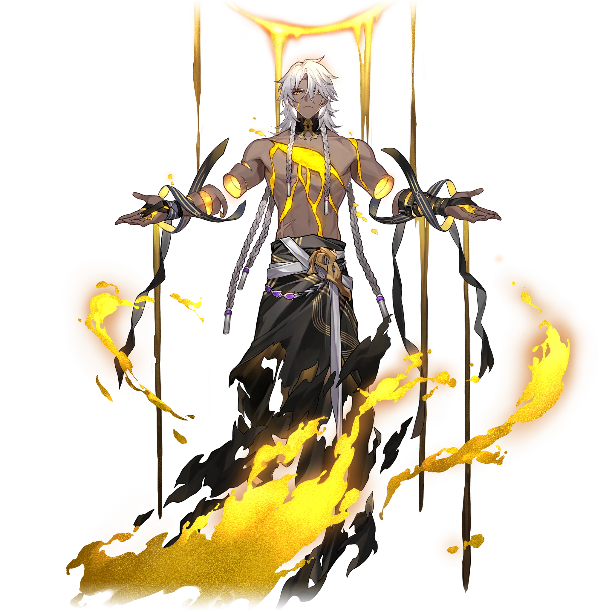

# Les Instigateurs de calamités

| Table des matières | 
|---| 
|• [Nanook la Destruction](#nanook-la-destruction) • [Tayzzyronth la Propagation](#tayzzyronth-la-propagation) • [Yaoshi l'Abondance](#yaoshi-labondance) |

### Nanook la Destruction
**Statut :** En vie

 

>~~*« Si la croissance de l'entropie est une loi fondamentale de l'univers, alors la mort thermique devrait être le destin inévitable du monde matériel. Par conséquent, pourquoi lutter pour survivre ? L'univers s'étend, fusionne, puis sera anéanti. Si nous voulons accueillir une nouvelle vie, nous devons d'abord accepter sa fin. »*~~
>
<i><s>— Paroles d'un scientifique juste avant qu'il n'appuie sur le bouton déclenchant une explosion nucléaire, 2152 E. A.</s></i>
 
>La naissance de l'univers est une erreur. Si la civilisation est un cancer né de l'immensité stellaire, alors la guerre est le seul langage commun connu de toute forme de vie intelligente.\
>Pour corriger le tir et laver l'univers de cette tache, Nanook est devenu l'avatar de l'entropie.
>
>---
>
Banque de données, Aiôns

Après avoir été témoin de la destruction d'Adlivun par l'Essaim et l'Empire des machines à sa naissance, Nanook estime que la création de l'univers est une erreur et cherche à tout détruire. Après son ascension en tant qu'Aiôn, Nanook aurait prétendument incendié son monde d'origine.

Bien qu'il soit le dernier Aiôn à s'être élevé, Nanook et ses serviteurs peuvent déjà être considérées comme la plus grande menace de toute la galaxie.

Nanook apparaît fréquemment sous la forme d'un homme à la peau brune, avec de longs cheveux blancs et deux tresses, ainsi que des yeux dorés. Une immense cicatrice, ainsi que de multiples autres plus petites, sont visibles sur sa poitrine, d'où s'échappe de l'ichor doré. Un quart de ses bras flotte et la moitié de ses membres inférieurs sont couverts de flammes dorées et de fumée noire, illustrant son désir de destruction.

---
### Tayzzyronth la Propagation
**Statut :** Inactif ; scellé dans une prison d'ambre

 

>~~*« Si des ombres surgissent à l'horizon en pleine journée, fermez vite vos portes et vos volets, car ce n'est pas le crépuscule qui arrive, mais bien l'Essaim affamé. »*~~
>
<s>— Fables sur les étoiles <i>par Adrian Spencer Smith</i></s>
 
>Tayzzyronth, également connu comme l'Imperator Insectorum, le Roi des sables ou le créateur du Désastre de l'Essaim.\
>En tant que dernier membre des Coléoptères, qui régnaient sur la terre, c'est la solitude qui lança Tayzzyronth sur sa Voie, qui se transforma en une horreur auto-duplicatrice, un torrent de propagation infinie. Tayzzyronth, ou plutôt les Tayzzyronths traversèrent les mondes jusqu'au moment où leur avancée fut stoppée.
>
>---
>
Banque de données, Aiôns

Tayzzyronth est un Aiôn uniquement animé par le besoin de se propager et de se répandre dans l'univers. Il est responsable de l'apparition de l'Essaim et de sa propagation dans l'univers durant le Désastre de l'Essaim.

Tayzzyronth se présente sous la forme d'un large insecte doté de six pattes et de deux grandes ailes. Au sommet de son corps se trouve une marionnette humanoïde sans visage pourvue de deux petites ailes dans son dos.

Lorsqu'il apparaît dans l'Univers simulé, il émet un cri strident accompagné d'un battement d'ailes, tandis que d'autres cris se font entendre au loin

---
### Yaoshi l'Abondance
**Statut :** En vie

 
