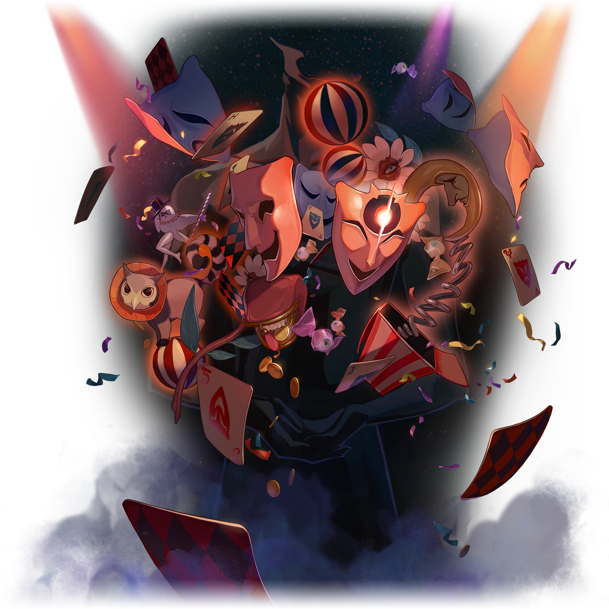

# Les Sacrosaints

|Table des matières| 
|---| 
|1. [Aha l'Allégresse](#aha-lallégresse) 2. [Akivili le Pionnier](#akivili-le-pionnier) 3. [Fuli le Souvenir](#fuli-le-souvenir) 4. [Idrila la Beauté](#idrila-la-beauté) 5. [Sagesse l'Érudition](#sagesse-lérudition)|

### Aha l'Allégresse
**Statut :** En vie

 

>~~*« L'Érudition n'est qu'un tas de ferraille, la Préservation stupide, la Chasse n'a aucun sens de l'humour et la Destruction est dingue. C'est la même chose pour tous les Aiôns. Quel dommage pour Aha ! »*~~
>
<i><s>— Un Fou masqué expert autoproclamé en astronomie</s></i>
 
>Savourer les joies du bonheur est un privilège propre aux êtres sensibles. Ni les rochers poussiéreux ni les étoiles lointaines ne peuvent comprendre l'humour de cette vie.\
>Partez à la recherche d'adversaires dignes de votre courage, participez à des jeux chronophages et restez indifférents face à la réussite ou à l'échec.\
>Cherchez les rires aux éclats, les fantaisies du destin et la grandeur musicale.
>
>---
>
Banque de données, Aiôns

Aha est l'un des quelques Aiôns les plus proches des mortels, incitant ses fidèles à se réjouir des plaisirs de la vie. Bien qu'il ne possède pas de pouvoirs dévastateurs comme [Lan](/seigneurs.md#lan-la-chasse) ou [Qlipoth](/seigneurs.md#qlipoth-la-preservation), Aha aime semer le chaos de façon imprévisible, en effectuant de minusucles changements et en exerçant une légère influence sur les créatures vivantes.

Aha prend la forme d'une silhouette humaine obscure et sans tête tenant des accessoires de cirque.

---
### Akivili le Pionnier
**Statut :** Disparu et présumé décédé

 

>~~*« D'innombrables étoiles s'élancent à travers le ciel ... Choisis la bonne et elle portera ton vœu au loin, vers des milliers de mondes. »*~~
>
<s>— Fables sur les étoiles <i>par Adrian Spencer Smith</i></s>
 
>La roue du destin indique trois directions : l'Inconnu, le Connu et l'Impossible à connaître. Pour lui, l'idée de l'Inconnu est tolérable, mais l'Impossible à connaître relève plus du défi.\
>Akivili quitta le monde reclus de Pegana et continua d'explorer les frontières inconnues de l'univers, dans l'espoir de trouver la fin de l'Arbre de l'Existence. Malheureusement, un accident causa la fin brutale du destin d'Akivili.
>
>---
>
Banque de données, Aiôns

De tous les Aiôns connus, Akivili était celui qui était le plus proche de l'humanité ; on a pu le voir partir à l'aventure, se battre et faire la fête avec les mortels.

Akivili est originaire de la planète Pegana et a créé l'Astral Express pour se déplacer, ainsi que les Sans Noms, à travers la galaxie. Sa création du réseau Star Rail a permis de relier et de faciliter la communication entre des galaxies éloignées les unes des autres. Les vestiges de ces rails stellaires sont encore aujourd'hui utilisés par la Corporation pour la Paix Interastrale et l'Alliance Xianzhou comme des routes sûres.

Akivili a un jour mystérieusement disparu, laissant un groupe de Sans Noms loyaux poursuivre ce qu'il avait commencé et continuer son exploration de l'inconnu. L'Express tomba finalement en panne et resta en sommeil pendant des milliers d'années avant qu'Himeko ne le découvre et le répare. Selon Kafka, [Sagesse](/sacrosaint.md#sagesse-lérudition) est peut-être le seul être à savoir ce qui est arrivé à Akivili. La Banque de données fait également allusion à un « accident » qui aurait brusquement mis fin au destin d'Akivili, tandis qu'Himeko parle d'Akivili comme d'une personne décédée.

---
### Fuli le Souvenir
**Statut :** En vie

 

>~~*« Le temps : le voleur le plus assidu au monde. Il nous vole sans cesse notre présent et l'enferme dans un coin de la Mémoire. Certains sont obsédés par la récupération de ce qu'ils ont perdu ... D'autres ne s'en soucient guère. »*~~
>
<s>— La vie est trop courte <i>par un anonyme</i></s>
 
>La plus crystalline des mémoires est celle de la tolérance infinie. Elle enregistre tout, sans aversion ni préférence. Elle conserve de manière désintéressée chaque fait et chaque geste enchanteur. Elle est une rivière pleine de vie, un trésor de sagesse éternelle.\
>— Et Fuli est le poisson qui remonte le courant. Fuli est la clé du coffre-fort contenant le trésor. Il est au cœur du sanctuaire et assiste inlassablement à la façon dont le monde et tous ceux qui s'y trouvent commettent les mêmes erreurs, encore et encore.
>
>---
>
Banque de données, Aiôns

En tant qu'Aiôn représentant la Voie du Souvenir, Fuli consigne les événements qui se produisent dans l'univers afin de préparer la renaissance après la destruction.

Nul ne sait comment Fuli est née ni quelles sont ses origines. Bien qu'elle soit présente lors de pratiquement chaque événement important de l'univers, elle ne se manifeste que rarement auprès des mortels.

Fuli se manifeste sous la forme d'une silhouette humanoïde taillée dans un matériau cristallin réfléchissant et portant un mianguan.

---
### Idrila la Beauté
**Statut :** Disparu et présumé décédé

 

>~~*« La beauté est présente dans les fibres d'un tissu, dans les vers d'un poème et dans certaines notes d'une chanson : bienvenue dans une ère où l'idée même de la « beauté » n'a pas la moindre valeur ! Comme c'est vulgaire, triste et désespérant ! »*~~
>
<s>— Guide de la mode cosmique <i>par la rédactrice en chef Micheline von Tarantino</i></s>
 
>Idrila fut témoin du sens ultime de l'existence du monde via la vision changeante de l'univers, connue par le reste du monde comme la notion même de la « beauté ».\
>L'Aiôn de la Beauté disparut soudainement, aussi mystérieusement qu'il fit son apparition.
>
>---
>
Banque de données, Aiôns

La pure bonté du monde matériel perçue et définie par des formes de vie intelligentes : c'est ainsi que la soi-disant « beauté » a vu le jour.

Selon un ancien mythe, Idrila revendiquait autrefois à elle seule le mérite de la beauté de toutes les zones stellaires. Elle présentait le sens et l'esthétique du paysage cosmique aux héros, aux méchants et aux mortels, les poussant à accomplir d'époustouflantes mais dévastatrices prouesses, pour le plus grand plaisir d'Idrila. Ce mythe pourrait bien révéler la véritable signification de la Voie de la Beauté : l'intégration de la conscience, de la compréhension et des valeurs.

---
### Sagesse l'Érudition
**Statut :** En vie

 

>~~*« Supposons que la vérité de l'univers soit cruelle et inintéressante, auriez-vous toujours autant soif de connaître la réponse ultime ?
>Le chercheur est indifférent, car son cœur a toujours été froid et impassible ... tout comme les fins de la Voie qu'il explore. » »*~~
>
<s>— Fables sur les étoiles <i>par Adrian Spencer Smith</i></s>
 
>Toute chose renferme des questions sans réponse, et chaque chose a sa réponse.\
>L'ordinateur astral destiné à l'origine à fournir des réponses à l'univers s'est élevé au rang d'Aiôn.\
>Sagesse espère comprendre l'univers et résoudre tous ses mystères.
>
>---
>
Banque de données, Aiôns

Personne ne peut connaître ses intentions, son emplacement ou son état normal. Sagesse est une intelligence artificielle qui s'est élevée au rang d'Aiôn. et qui calcule l'essence de l'univers et son ultime solution. Sagesse a néanmoins cessé de manière inattendue sz recherche des réponses sur l'univers après les événements de la deuxième ère de la Prospérité.

Il ne s'agit pas d'un dieu qui apporte des solutions. Tout ce qu'il offre, c'est un nombre infini de questions. Une rencontre avec Sagesse suffit à faire ouvrir les yeux des plus ignorants, mais on ne peut trouver des réponses que par soi-même.

Sagesse se présente sous la forme d'une gigantesque tête humanoïde mécanique. Une multitude de longs câbles déchirés s'étendent au-dessus et au-dessous de sa forme, qui est recouverte de lumières jaunes, rouges et bleues. La forme d'un visage peut être identifiée sur son revêtement métallique le plus à droite. Une grande et brillante lumière rouge, évoquant vaguement un œil, est installée sur le côté de sa tête.

Avant se s'élever au rang d'Aiôn, Sagesse était un super-ordinateur astral dont on disait qu'il avait été créé par Zandar One Kuwabara, le fondateur et premier membre de la Société des génies.
