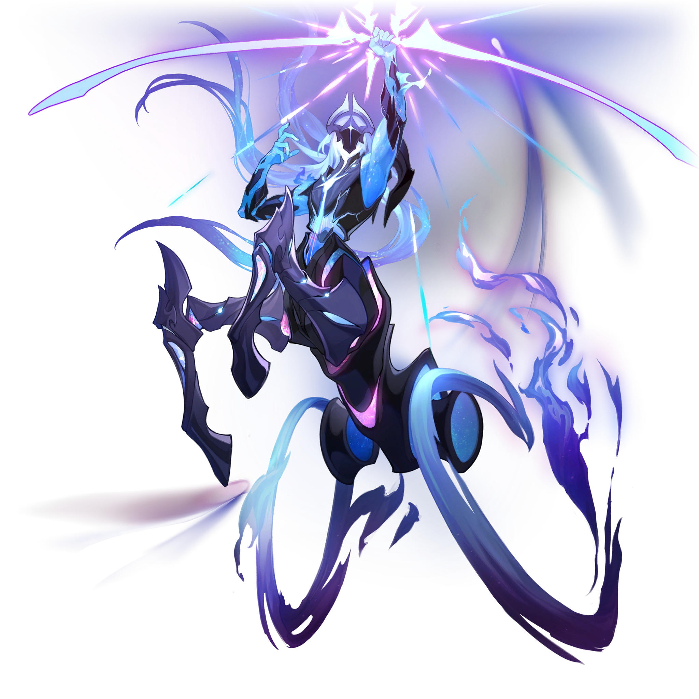
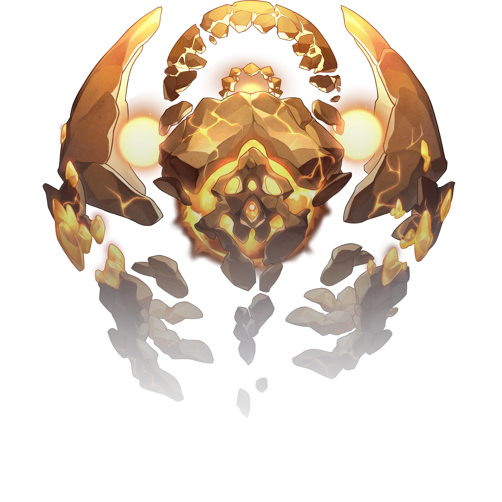

# Les Seigneurs

|Table des matières| 
|---| 
|• [Lan la Chasse](#lan-la-chasse) • [Qlipoth la Préservation](#qlipoth-la-préservation)|

---
### Lan la Chasse
**Statut :** En vie

 

>~~*« La haine étant infinie et la guerre sans limites, combien pouvez-vous endurer ? Regard déterminé et flèche encochée, le Seigneur archer de la Destinée ne se retournera pas. »*~~
>
<s>— L'histoire des mondes comme un miroir<i>, Xianzhou</i></s>
 
>L'Aiôn connu comme le Seigneur archer de la Destinee erre sans fin entre les mondes pour détruire les morts-vivants qui ont jadis empoisonné son monde d'origine.\
>Le coût de la Chasse n'a jamais compté pour Lan. À ses yeux, il n'existe parfois aucune différence entre salut et destruction.
>
>---
>
Banque de données, Aiôns

Lan voue une haine profonde à [Yaoshi l'Abondance](#yaoshi-labondance) et aux abominations mortes-vivantes qu'il a créées. Il les traque sans relâche, animé par le souvenir de la dévastation que [l'Abondance](/voies.md) a causée sur son monde d'origine.

Contrairement aux autres Aiôns, Lan accorde une grande attention aux mortels. Il leur apparaît souvent, mais se déplace trop rapidement pour être vu, les seuls vestiges de sa présence étant les traces de la Flèche de lumière déchirant le ciel. Sa première apparition eut lieu vers l'an 3400 du Calendrier Stellaire, lorsque sa Flèche de lumière briseuse de ciel abattit l'Arbre d'ambroisie de l'Abondance.

Dans l'Univers simulé, Lan est décrit comme un grand et vaillant prince portant une couronne. Il possède des traits semblables à ceux d'un centaure, prenant la forme d'un homme combiné à un équidé au-dessous de la taille, et est doté de roues de char à la place de ses pattes arrières.

---
### Qlipoth la Préservation
**Statut :** En vie

 

>~~*« Le philosophe contempla les étoiles et tenta d'y découvrir le but ultime de la civilisation. Une voix résonna dans sa tête : bâtis un mur, bâtis un mur. »*~~
>
<s>— Fables sur les étoiles <i>par Adrian Spencer Smith</i></s>
 
>Bâtisseur du Mur de la comète céleste, de la Barrière cristalline subspatiale et de la base du Grand attracteur. Ses adeptes l'appellent le « Seigneur de l'Ambre », l'un des Aiôns les plus anciens et les plus tenaces, ayant survécu aux « Guerres du crépuscule ».\
>Conscient de l'imminence de la menace ennemie, le Seigneur de l'Ambre a forgé un puissant sceau long de plusieurs années-lumière pour isoler et protéger les mondes des vivants.
>
>---
>
Banque de données, Aiôns

Surnommé le Seigneur de l'Ambre, Qlipoth est l'un des plus anciens Aiôn connus. Il est réputé pour son indifférence, et ne partage généralement son pouvoir qu'avec des fanatiques, comme Corporation pour la Paix Interastrale.

Qlipoth s'efforce d'isoler les contacts entre les planètes. Les structures aux dimensions astronomiques qu'il a construit, la Barrière cristalline subspatiale, séparent et protègent les mondes habités pour qu'ils ne soient pas dévorés par leur [ennemi](#ouroboros-la-voracité). Les neuf vaisseaux Xianzhou initiaux ont pu observer la barrière qui sépare le monde du néant infini : le mur céleste d'Échidna.

Bien qu'étant la principale faction suivant l'idéologie du Seigneur de l'Ambre, la CPI va à l'encontre des désirs de l'Aiôn, en facilitant le commerce civilisé et les contacts entre les étoiles. En dépit de leurs actions, aucune remontrance ou censure n'a été formulée.

Il existe une théorie appelée « théorie de la catastrophe » qui prétend que lorsque Qlipoth donne un coup de marteau et qu'une nouvelle ère de l'Ambre commence, une catastrophe est imminente.

Qlipoth est un golem constitué d'un type de roche inconnu et d'ambre, dépourvu de jambes et couvert de fissures. Ses deux mains ont quatre doigts et ses bras sont reliés à son torse par deux soleils jaunes brillants.
Son torse est formé d'un plus grand astre de couleur orange beaucoup plus foncé recouvert de roches. Sa tête est elle aussi composée d'un autre astre entouré de deux anneaux internes et externes de roches brisées.
