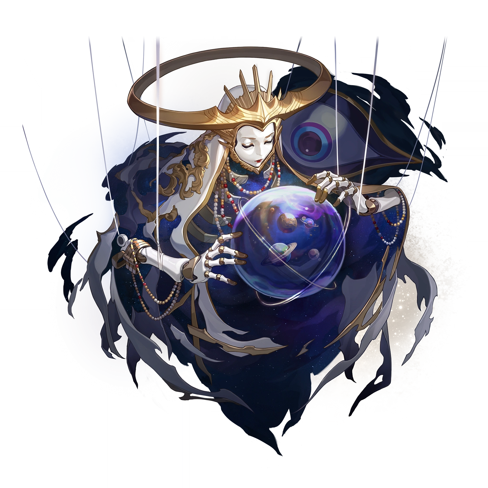
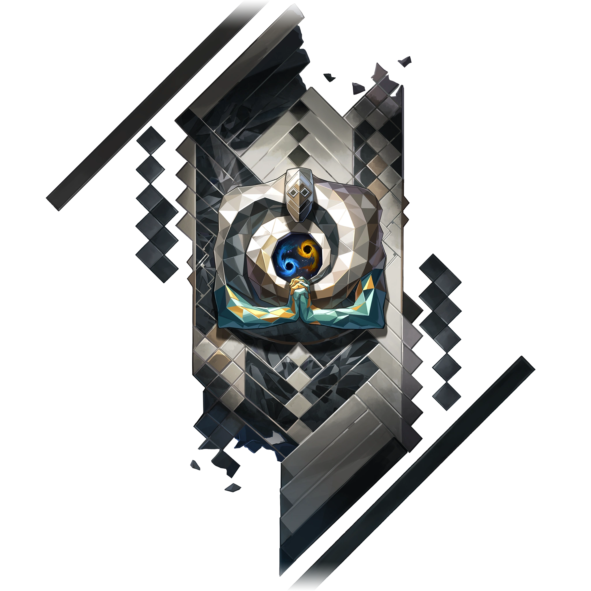
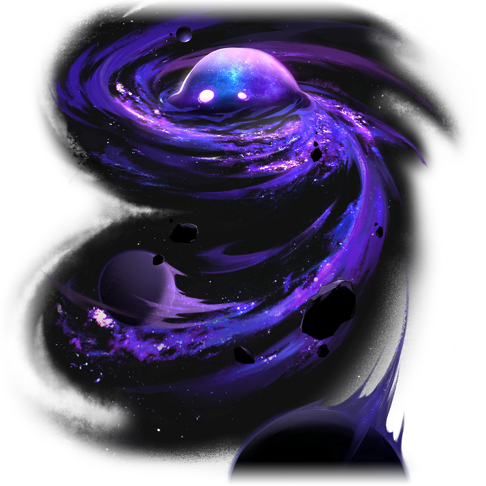
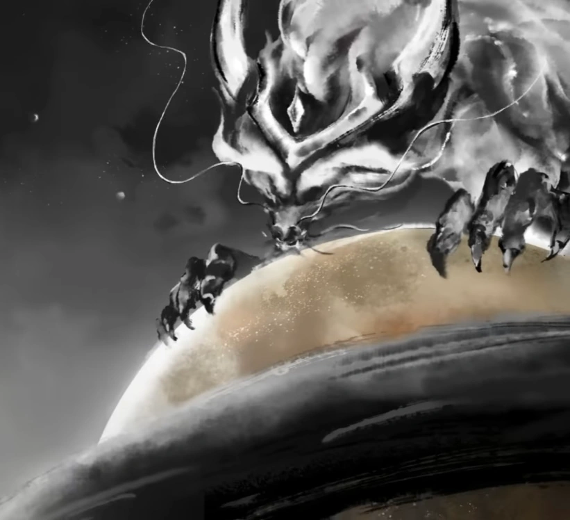
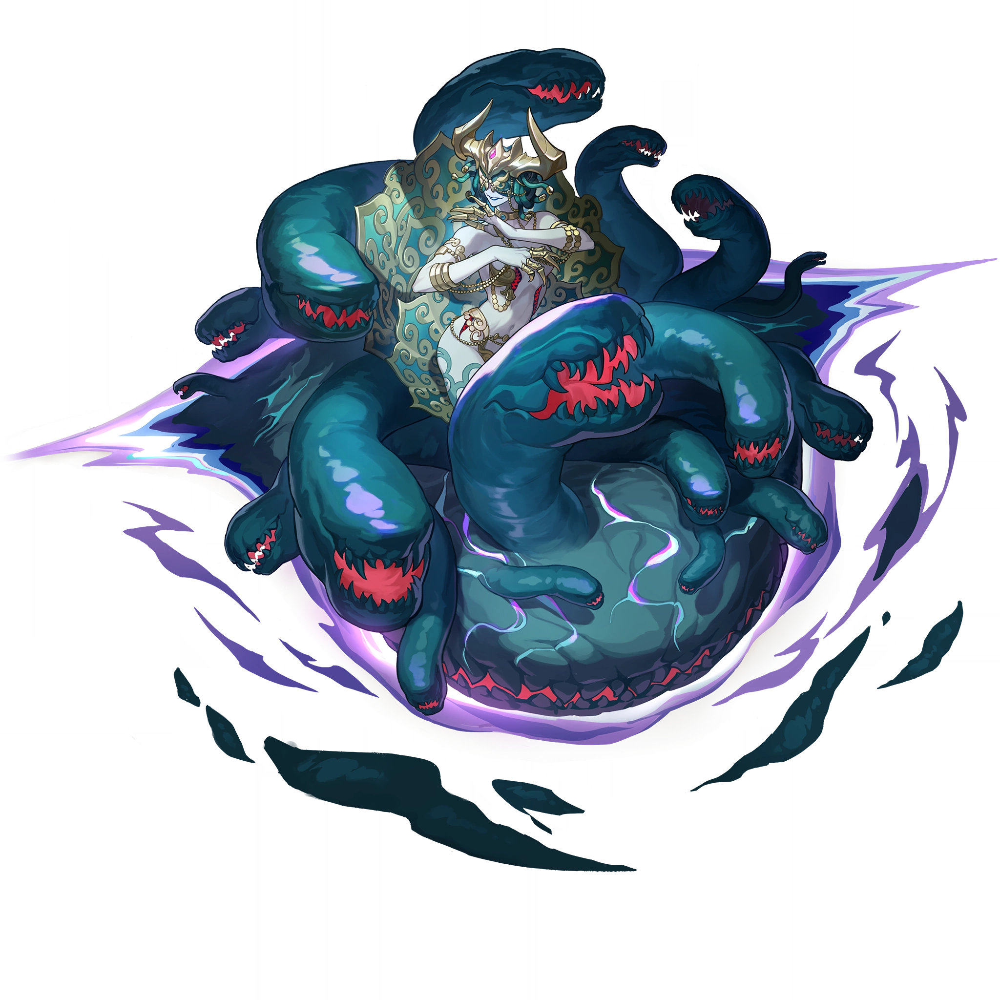
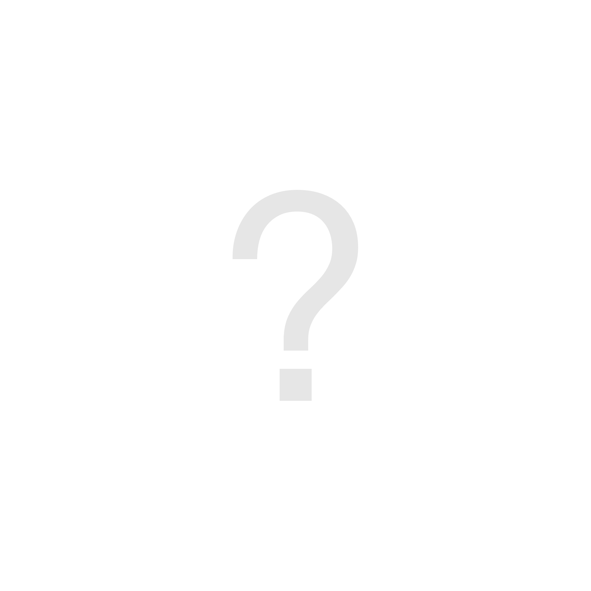

# Les Seigneurs

|Table des matières| 
|---| 
|• [Lan la Chasse](#lan-la-chasse) • [Qlipoth la Préservation](#qlipoth-la-préservation)|

---
### Ena l'Ordre
**Statut :** Absorbé par [Xipe](#xipe-lharmonie)

 

Ena était l'un des plus anciens Aiôns, qualifié d'être de justice et de magnificence. Elle surveillait attentivement les actions des mortels pour assurer l'ordre de l'univers, tout en faisant preuve d'intolérance à l'égard de toute forme de chaos ou de conflit. Avant sa chute, sa Voie avait éliminé de nombreuses calamités, telles que le Désastre de l'Essaim.

Sa voix est composée de syllabes qui suivent l'ascension et la chute des civilisations en accord avec la Voie de l'Aiôn. Elle fut absorbée lors du Désastre de l'Essaim par Xipe lorsque ce dernier devint un Eon, en raison du chevauchement de l'Harmonie avec le concept de l'Ordre.

Ena prend la forme d'un œil géant observant et manipulant une marionnette blanche et dorée sans tronc, voilée d'un tissu en lambeaux également blanc et doré, et couronnée d'une auréole d'or. La marionnette tient et contemple un orbe renfermant le cosmos.

---

### HooH l'Équilibre
**Statut :** En vie

 

>~~*« J'ai volé les poids en or et les répercussions ont fait ma fierté. L'Aiôn déjoue toujours mes tours et les étoiles remettent les comptes à zéro. »*~~
>
<s>— Fables sur les étoiles <i>par Adrian Spencer Smith</i></s>
 
>La chaîne du karma, qui obsède tant les mortels, n'est qu'une approximation grossière de la complexité présidant aux choses. HooH a dissous sa volonté dans la logique de l'univers pour maintenir à jamais l'équilibre et la stabilité de toute chose.\
>Les mortels les plus audacieux recherchent des failles dans le mouvement de l'univers, car ils croient que leur intelligence dépasse celle des Aiôns. Mais ils sont loin d'imaginer qu'ils ne sont que de simples fils d'un système de surveillance, incapables d'échapper au réseau de précision tissé par HooH.
>
>---
>
Banque de données, Aiôns

Sa forme n'est connue de personne.

HooH et ses Émanateurs influencent subrepticement l'univers afin d'atteindre l'équilibre parfait.

---
### IX la Nihilité
**Statut :** En vie

 

>~~*« Vous pouvez plonger le regard dans l'immensité des étoiles, mais ne regardez pas le gouffre du néant ... car il ne contient rien, sauf sa capacité à égarer l'esprit des mortels. »*~~
>
<i><s>— Murong, Docteur du chaos</s></i>
 
>L'existence de la Nihilité est en soi un mystère, et sa forme est enveloppée de brume.\
>IX n'interagit jamais avec les autres Aiôns et croit que l'essence du multivers est de plonger dans le néant, et que l'existence n'a donc aucune valeur.
>
>---
>
Banque de données, Aiôns

IX est un Aiôn indifférent, persuadé que l'existence n'a aucun sens et qu'il est donc inutile de faire quoi que ce soit. Il n'interagit pas avec les autres Aiôns et son existence est un mystère. Le simple fait de se trouver à proximité de la forme de IX peut susciter un état d'engourdissement et de découragement.

IX ressemble à un gros blob violet avec deux yeux blancs attirant vers lui de nombreux astéroïdes et planètes. Ce qui paraît être son corps est une nébuleuse tourbillonnante d'étoiles magenta et bleues enveloppées par un grand gaz violet. Il est possible que la forme de IX ressemble volontairement au chiffre 9, ce qui correspond à la signification de son nom en chiffres romains.

---
### Lan la Chasse
**Statut :** En vie

 

>~~*« La haine étant infinie et la guerre sans limites, combien pouvez-vous endurer ? Regard déterminé et flèche encochée, le Seigneur archer de la Destinée ne se retournera pas. »*~~
>
<s>— L'histoire des mondes comme un miroir<i>, Xianzhou</i></s>
 
>L'Aiôn connu comme le Seigneur archer de la Destinee erre sans fin entre les mondes pour détruire les morts-vivants qui ont jadis empoisonné son monde d'origine.\
>Le coût de la Chasse n'a jamais compté pour Lan. À ses yeux, il n'existe parfois aucune différence entre salut et destruction.
>
>---
>
Banque de données, Aiôns

Lan voue une haine profonde à [Yaoshi l'Abondance](#yaoshi-labondance) et aux abominations mortes-vivantes qu'il a créées. Il les traque sans relâche, animé par le souvenir de la dévastation que [l'Abondance](/voies.md) a causée sur son monde d'origine.

Contrairement aux autres Aiôns, Lan accorde une grande attention aux mortels. Il leur apparaît souvent, mais se déplace trop rapidement pour être vu, les seuls vestiges de sa présence étant les traces de la Flèche de lumière déchirant le ciel. Sa première apparition eut lieu vers l'an 3400 du Calendrier Stellaire, lorsque sa Flèche de lumière briseuse de ciel abattit l'Arbre d'ambroisie de l'Abondance.

Dans l'Univers simulé, Lan est décrit comme un grand et vaillant prince portant une couronne. Il possède des traits semblables à ceux d'un centaure, prenant la forme d'un homme combiné à un équidé au-dessous de la taille, et est doté de roues de char à la place de ses pattes arrières.

---
### Long la Permanence
**Statut :** Décédé

 

Il y a un nombre incalculable d'ères de l'Ambre, Long parcourut l'univers avec pour principal objectif de trouver le sens de la vie elle-même. Au terme de sa vie, il trouva sa réponse, qui devint connue sous le nom de révélation de la Permanence. Nul ne connaît précisément les véritables idéaux de l'Eon, mais le scribe du Candélagraphe de la Guilde de l'intelligentsia, Oppenheimer, est arrivé à certaines conclusions.

Il est possible que Long ait défini le sens de l'existence comme étant « la nature intemporelle de la grandeur de chacun ». Sa décision de se réincarner, abhorrant l'immortalité biologique, a également conduit le scribe à se demander si la révélation postulait la « continuité de la lignée familiale ». Par ailleurs, la décision des Grands anciens des Vidyadhariens de se joindre à l'Alliance Xianzhou témoigne de leur inclinaison en faveur d'une « noble ambition qui garantit la sécurité de l'univers ».

Long était le « Père des dragons », et prenait autrefois la forme d'un dragon géant. Il laisse derrière lui un grand nombre de descendants appelés « Scions de Long ».

---
### Mythus l'Enigmata
**Statut :** En vie

 

>~~*« Arrêter de se poser des questions, ça revient à demander à la pluie de renoncer à sa foi envers les étoiles scintillantes. Ouvrez-vous à la rivière rugissante des métaphores et vous trouverez la vérité qui se cache à l'extrémité du ciel étoilé, dans les tempêtes idylliques d'un âge révolu. »*~~
>
<i><s>— Sharon Leighton, poétesse lauréate galactique (autoproclamée)</s></i>
 
>C'est un mensonge de dire que toute chose peut-être vécue et reconnue. Les vivants cherchent à écrire des prophéties sur l'inconnu en se reposant sur leur sens limité de l'ordre de l'univers. Cependant, ils sont loin d'imaginer que celui-ci est infini et que la vérité n'est qu'une illusion trompeuse.
>
>Dans le but d'empêcher la certitude que [l'Érudition](/voies.md) apportait en détruisant les possibilités défendues par Mythus, ce dernier a invoqué le Brouillard de la pensée et la Pluie de sensations afin de révéler aux mortels l'inexplicable vérité à l'aide de quatre agents : Transformation, Écran, Énigme et Mirage.
>
>---
>
Banque de données, Aiôns

Il considère que la perception surpasse tout et que les entités limitées sont incapables de concevoir l'infini tel qu'il est, ce qui fait que toute chose est énigmatique.

Mythus ressemble à une une méduse brisée et déchirée, semblable à une version délibérément détruite du centre « cognitif » du cerveau humain. Il a une apparence humanoïde entourée d'un escalier.

---
### Ouroboros la Voracité
**Statut :** Inactif ; a disparu durant le Désastre de l'Essaim

 

>~~*« Les insectes sont aux oiseaux ce que les lièvres sont aux loups. Les étoiles sont aux trous noirs, ce que les mondes sont à la voracité. »*~~
>
<s>— L'histoire des mondes comme un miroir<i>, Xianzhou</i></s>
 
>Le buveur de mondes, le devoreur insatiable, le trou noir qui pense. Il est à la fois un Aiôn et un Léviathan.\
>Aux yeux d'Ouroboros, la vie est un fragment vacillant qui flotte dans la mer du néant, destiné à retourner dans les ténèbres avec les étoiles qui les ont engendrées. Ces ténèbres se trouvent au fin fond de ses gosiers.
>
>---
>
Banque de données, Aiôns

Il dévore les mondes insatiablement. Les légendes racontent qu'il aurait également la forme d'une sorte de créature ancestrale appelée Léviathan.

---
### Qlipoth la Préservation
**Statut :** En vie

 

>~~*« Le philosophe contempla les étoiles et tenta d'y découvrir le but ultime de la civilisation. Une voix résonna dans sa tête : bâtis un mur, bâtis un mur. »*~~
>
<s>— Fables sur les étoiles <i>par Adrian Spencer Smith</i></s>
 
>Bâtisseur du Mur de la comète céleste, de la Barrière cristalline subspatiale et de la base du Grand attracteur. Ses adeptes l'appellent le « Seigneur de l'Ambre », l'un des Aiôns les plus anciens et les plus tenaces, ayant survécu aux « Guerres du crépuscule ».\
>Conscient de l'imminence de la menace ennemie, le Seigneur de l'Ambre a forgé un puissant sceau long de plusieurs années-lumière pour isoler et protéger les mondes des vivants.
>
>---
>
Banque de données, Aiôns

Surnommé le Seigneur de l'Ambre, Qlipoth est l'un des plus anciens Aiôn connus. Il est réputé pour son indifférence, et ne partage généralement son pouvoir qu'avec des fanatiques, comme Corporation pour la Paix Interastrale.

Qlipoth s'efforce d'isoler les contacts entre les planètes. Les structures aux dimensions astronomiques qu'il a construit, la Barrière cristalline subspatiale, séparent et protègent les mondes habités pour qu'ils ne soient pas dévorés par leur [ennemi](#ouroboros-la-voracité). Les neuf vaisseaux Xianzhou initiaux ont pu observer la barrière qui sépare le monde du néant infini : le mur céleste d'Échidna.

Bien qu'étant la principale faction suivant l'idéologie du Seigneur de l'Ambre, la CPI va à l'encontre des désirs de l'Aiôn, en facilitant le commerce civilisé et les contacts entre les étoiles. En dépit de leurs actions, aucune remontrance ou censure n'a été formulée.

Il existe une théorie appelée « théorie de la catastrophe » qui prétend que lorsque Qlipoth donne un coup de marteau et qu'une nouvelle ère de l'Ambre commence, une catastrophe est imminente.

Qlipoth est un golem constitué d'un type de roche inconnu et d'ambre, dépourvu de jambes et couvert de fissures. Ses deux mains ont quatre doigts et ses bras sont reliés à son torse par deux soleils jaunes brillants.
Son torse est formé d'un plus grand astre de couleur orange beaucoup plus foncé recouvert de roches. Sa tête est elle aussi composée d'un autre astre entouré de deux anneaux internes et externes de roches brisées.

---
### Terminus la Finalité
**Statut :** En vie

 

Terminus voyage dans le temps depuis le futur. IL apparaît à chaque moment de la Finalité, apportant des prophéties à propos de l'avenir. Selon Élégie, membre des Exequaturs du Credo, la Finalité est la fin des autres Aiôns et Voies. [La Destruction](#nanook-la-destruction) elle-même ne peut être épargnée. Pourtant, la Finalité n'est pas la fin de tout ce qui est. Toutes les choses naîtront là et se dirigeront vers la Finalité suivante.

---
### Xipe l'Harmonie
**Statut :** En vie

 

>~~*« Le monde est en harmonie et les étoiles brillent de mille feux. Louée soit son Éminence ! Tout est connecté et le vent de la bénédiction souffle à travers les terres ! »*~~
>
<s>— Odes de l'Harmonie<i>, I</i></s>
 
>Un Aiôn multiple venu de plusieurs mondes harmonieux. La glorieuse Xipe aux mille visages entonne des chants de joie et d'unité.\
>Pour combattre la brutalité des lois de l'univers, les formes de vie intelligentes doivent oublier leur lâche égoïsme et les différences entre les êtres pour fusionner en un chant harmonieux, et pousser les forts à aider les faibles et protéger la vie avec la mort.
>
>---
>
Banque de données, Aiôns

